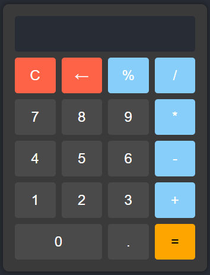
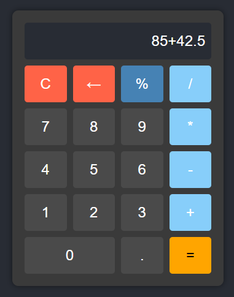

# Calculadora Básica

## Descrição

Uma calculadora básica com operações aritméticas fundamentais (adição, subtração, multiplicação, divisão) e funções adicionais como porcentagem.

## Tecnologias Utilizadas

- HTML5
- CSS3
- JavaScript

## Funcionalidades

- Operações aritméticas básicas: adição, subtração, multiplicação e divisão.
- Função de porcentagem.
- Limpar o display.
- Apagar o último dígito.
- Interface responsiva e estilizada.

## Upgrade da Versão Básica para a Versão 2.0

### Versão Básica

A versão básica da calculadora incluía as seguintes funcionalidades:

- Operações básicas: adição, subtração, multiplicação e divisão.
- Limpar o display e apagar o último dígito.
- Interface simples.

### Versão 2.0

A versão 2.0 da calculadora inclui melhorias e novas funcionalidades:

- **Função de porcentagem:** Agora é possível calcular porcentagens, aplicando a porcentagem ao último número inserido em relação ao primeiro número da operação.
- **Melhoria na Estilização:** Interface de usuário vem com um tema moderno e responsivo, utilizando as cores cinza escuto, azul claro e laranja para os botões principais.
- **Código otimizado:** Refatoração do código JavaScript para maior clareza e eficiência.
- **Comentários detalhados:** Adição de comentários no código para facilitar a compreensão e manutenção.

## Capturas de Tela Versão 2.0




## Capturas de Tela Versão Básica


## Como Executar o Projeto

1. Clone o repositório:
    ```sh
    git clone hhttps://github.com/josealexandre87/calculadora_basica.git
    ```
2. Navegue até o diretório do projeto:
    ```sh
    cd calculadora_basica
    ```
3. Abra o arquivo `index.html` no seu navegador preferido.

## Licença

Este projeto está licenciado sob a Licença MIT. Veja o arquivo [LICENSE](LICENSE) para mais detalhes.
