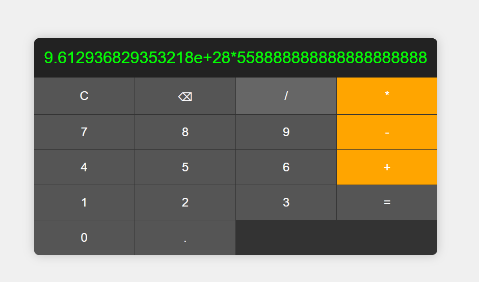

# Calculadora Básica

Este projeto é uma calculadora simples que realiza operações básicas de adição, subtração, multiplicação e divisão.

## Descrição

A aplicação permite que o usuário insira números e operadores, exiba o resultado da expressão matemática e use funções de limpeza e exclusão. As principais teclas de operações são destacadas em laranja.

## Tecnologias Utilizadas

- HTML5
- CSS3
- JavaScript

## Como Executar o Projeto

1. Clone o repositório:
    ```sh
    git clone hhttps://github.com/josealexandre87/calculadora_basica.git
    ```
2. Navegue até o diretório do projeto:
    ```sh
    cd calculadora_basica
    ```
3. Abra o arquivo `index.html` no seu navegador preferido.

## Funcionalidades

- **Adição**
- **Subtração**
- **Multiplicação**
- **Divisão**
- **Limpar**: Limpa o display da calculadora.
- **Excluir Último Dígito**: Remove o último dígito ou operador inserido.

## Capturas de Tela


## Futuras Correções

- **Excesso de Dígitos**: A CSS da calculadora deforma conforme excesso de dígitos.



## Licença

Este projeto está licenciado sob a Licença MIT. Veja o arquivo [LICENSE](LICENSE) para mais detalhes.
